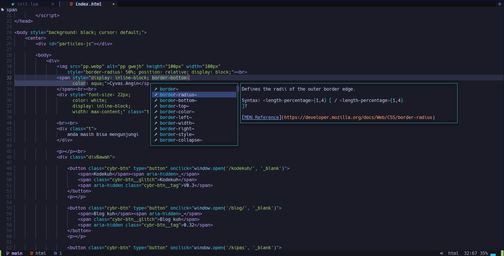

# My AstroNvim Configuration
## Screenshot
 
## How To Install
I. Backup before Installation
- `mv ~/.config/nvim/lua/user/ ~/.config/nvim/lua/user_Backup`

II. clone this repository 
- `git clone git@github.com:cyvas8x/astronvim_config.git ~/.config/nvim/lua/user/`

III. Sync The Package To download All Plugins
- :PackerSync

IIII. Install LSP and TS for Snippet and autocomplete
- :LspInstall <language_to_install>
- :TSInstall <language_to_install>

IIIII. DONE

## General Mappings

| Action                                  | Mappings                      |
| ---------------                         | ----------------              |
| Escape key                              | `jk, jj, qw`                  |
| Next Buffer                             | `Ctrl + PageDown` or `Shift-L`|
| Previous Buffer                         | `Ctrl + PageUp` or `Shift-H`  |
| Open File Manager in current file       | `Space + af`                  |
| Search Text in current File             | `Space + as`                  |
| Set Directory to Current File Directory | `Space + ac`                  |

Go to `Space + a` to get My Custom Config List

## Plugins
- [tokyonight.nvim](https://github.com/folke/tokyonight.nvim) - Neovim Theme
- [markdown-preview.nvim](https://github.com/iamcco/markdown-preview.nvim) - Fast Markdown Preview

## Special Thanks
- [AstroNvim](https://github.com/AstroNvim/) 
